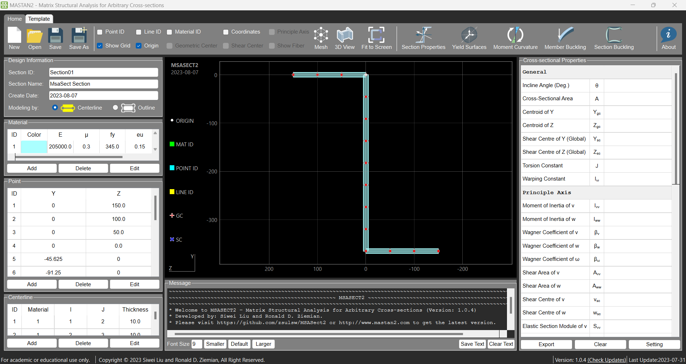

<!-- MSASect2 and logo -------------------------------------------------------------------------->

 <h1 style="font-size: 50px; margin-right: 100px;"> <strong>MSASect2</strong>      
    

<!-- buttons for contents -------------------------------------------------------------------------->
<!--# MSASect2-->

  

    
    
   
   
   
   
   
   
   
   
   
    

<!-- Mainscreen --------------------------------------------------------------------------------->

 

<!-- Sections --------------------------------------------------------------------------------->

## Installation
<!-- Installation instructions go here -->

## Usage
<!-- Usage instructions go here -->

## Features
<!-- Features description goes here -->

## Bugs/Requests
Please send bug reports and feature requests through GitHub issue tracker. MSASect2 is currently under development now, and it's open to any constructive suggestions.

## Contributing
<!-- Guidelines for contributing go here -->

## Documentation
<!-- Documentation links go here -->

## Contact
<!-- Contact information goes here -->

## License
<!-- License information goes here -->

## Examples
<!-- Examples go here -->

## Acknowledgements
<!-- Acknowledgements go here -->

## Conclusion
<!-- Conclusion goes here -->
